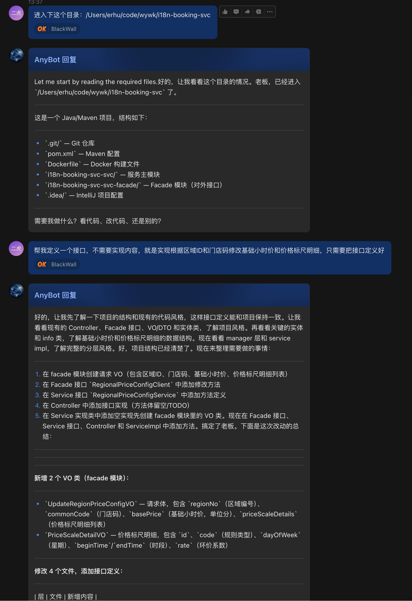

[中文](./README.md) | **English**

# AnyBot

Turn AI CLI tools into remotely accessible AI assistants — chat through the built-in **Web UI** in your browser, or message the AI running on your machine anytime via **Feishu Bot** / **QQ Bot** / **Telegram Bot** on mobile or desktop.

Currently supports [OpenAI Codex CLI](https://github.com/openai/codex), [Google Gemini CLI](https://github.com/google-gemini/gemini-cli), [Cursor CLI](https://docs.cursor.com/cli), and [Qoder CLI](https://docs.qoder.com) as Providers. The architecture is ready for more CLI tools (Claude Code, etc.).

Supports **macOS** and **Linux**.

---

## Features

- **Multi-Provider Architecture** — Pluggable AI CLI backends; currently supports Codex CLI, Gemini CLI, Cursor CLI, and Qoder CLI, with more to come
- **Web UI** — Built-in local chat interface with Markdown rendering, code highlighting, and session management
- **Multi-Platform Integration** — Feishu (long connection), QQ Bot (WebSocket), and Telegram simultaneously — works on mobile too
- **Skill Management** — Browse, enable/disable, and delete skills from the Web UI
- **Session Continuity** — Reuses Provider's native sessions to preserve context; type `/new` to start fresh
- **Image Understanding** — Send images for multimodal conversations
- **File Delivery** — Generated images and files are automatically sent back to the chat
- **Model Switching** — Switch Provider and model anytime via `/provider` and `/model` commands in Web UI or chat
- **Chat Commands** — Unified `/help`, `/new`, `/provider`, `/model` commands across all channels
- **Background Mode** — Daemon mode support, ready on boot
- **One-Click Setup** — Interactive `setup.sh` guides you through all configuration, auto-detects dependencies and selects Provider

---

## Screenshots

| Chat Interface | Model Switching |
|:---:|:---:|
|  |  |

| Provider Switching | Channel Management |
|:---:|:---:|
|  |  |

| Skill Management | Mobile Usage |
|:---:|:---:|
|  |  |

---

## Quick Start

### 1. Prerequisites

| Dependency | Minimum Version | Note |
|------------|----------------|------|
| [Node.js](https://nodejs.org/) | 18+ | Runtime |
| npm | Bundled with Node.js | Package manager |

Plus at least one Provider CLI:

| Provider | Installation | Note |
|----------|-------------|------|
| [Codex CLI](https://github.com/openai/codex) | `npm install -g @openai/codex` | OpenAI's CLI tool |
| [Gemini CLI](https://github.com/google-gemini/gemini-cli) | See [official docs](https://github.com/google-gemini/gemini-cli) | Google's CLI tool |
| [Cursor CLI](https://docs.cursor.com/cli) | Enable `agent` command in Cursor settings | Cursor editor's Agent CLI |
| [Qoder CLI](https://docs.qoder.com) | See [official docs](https://docs.qoder.com) | Qoder's AI CLI tool |

<details>
<summary><b>Linux Installation</b></summary>

**Ubuntu / Debian:**

```bash
curl -fsSL https://deb.nodesource.com/setup_lts.x | sudo -E bash -
sudo apt-get install -y nodejs
```

**CentOS / RHEL / Fedora:**

```bash
curl -fsSL https://rpm.nodesource.com/setup_lts.x | sudo bash -
sudo yum install -y nodejs   # Use dnf for Fedora
```

**Using nvm (recommended, no sudo needed):**

```bash
curl -o- https://raw.githubusercontent.com/nvm-sh/nvm/v0.40.3/install.sh | bash
source ~/.bashrc   # or source ~/.zshrc
nvm install --lts
```

</details>

<details>
<summary><b>macOS Installation</b></summary>

```bash
brew install node
```

</details>

### 2. Clone & Configure

```bash
git clone https://github.com/1935417243/AnyBot.git
cd AnyBot
sh setup.sh
```

`setup.sh` will guide you through:
- Detecting OS and base dependencies (Node.js, npm)
- **Choosing a default Provider** (Codex CLI / Gemini CLI / Cursor CLI)
- Checking if the corresponding CLI is installed, with installation guidance
- Setting the working directory
- Configuring safety mode (Codex: Sandbox mode / Gemini: Approval Mode)
- Configuring the Web UI port
- Generating the `.env` config file (with settings for all Providers)
- Installing npm dependencies

### 3. Start

```bash
# Foreground
npm start

# Background (daemon)
npm run bot:start

# Check status
npm run bot:status

# Stop
npm run bot:stop
```

Once started, open `http://localhost:19981` to use the Web UI.

### 4. Manual Configuration (Optional)

If you prefer not to use the setup script:

```bash
cp .env.example .env
# Edit .env, set PROVIDER and corresponding CLI settings
npm install
npm start
```

---

## Provider Architecture

AnyBot uses a pluggable Provider architecture where each AI CLI tool maps to a Provider implementation:

| Provider | Status | CLI Tool | Note |
|----------|--------|----------|------|
| `codex` | ✅ Available | [Codex CLI](https://github.com/openai/codex) | OpenAI's CLI, supports Sandbox mode |
| `gemini-cli` | ✅ Available | [Gemini CLI](https://github.com/google-gemini/gemini-cli) | Google's CLI, supports session continuity |
| `cursor-cli` | ✅ Available | [Cursor CLI](https://docs.cursor.com/cli) | Cursor's Agent CLI, supports session continuity & Sandbox |
| `qoder-cli` | ✅ Available | [Qoder CLI](https://docs.qoder.com) | Qoder's CLI, supports session continuity |
| `claude-code` | 🔜 Planned | [Claude Code](https://docs.anthropic.com/en/docs/claude-code) | Anthropic's CLI |

Switch the default Provider via the `PROVIDER=codex`, `PROVIDER=gemini-cli`, `PROVIDER=cursor-cli`, or `PROVIDER=qoder-cli` environment variable, or switch anytime in the Web UI.

---

## Web UI

Built-in web chat interface, no extra deployment needed:

- Multi-session management with persistent history (SQLite)
- Markdown rendering + syntax highlighting + one-click copy
- Provider and model switching
- Channel configuration management (Feishu, QQ Bot, Telegram)
- Skill management (browse, enable/disable, delete)
- Dark theme

---

## Feishu Integration

Connected via Feishu's long connection mode — **no public callback URL required**.

### Feishu Setup

After creating an app on the [Feishu Open Platform](https://open.feishu.cn/):

1. Enable the **Bot** capability
2. Enable **Long Connection** event subscription
3. Subscribe to the `im.message.receive_v1` event
4. Grant **Send Message** permission
5. For image messages, also grant **Read Message Resource** permissions
6. Publish the app

### Connection Configuration

Channel configs are stored in `.data/channels.json`. Three ways to manage:

| Method | Description |
|--------|-------------|
| **Web UI** | Configure App ID / App Secret in the settings page after starting the service |
| **REST API** | `GET /api/channels` to view, `PUT /api/channels/:type` to update |
| **Manual Edit** | Edit `.data/channels.json` directly |

<details>
<summary><b>channels.json Full Field Reference</b></summary>

```jsonc
{
  "feishu": {
    "enabled": true,
    "appId": "cli_xxxx",
    "appSecret": "xxxx",
    "groupChatMode": "mention",   // "mention" (reply only when @bot) or "all" (reply to all messages)
    "botOpenId": "ou_xxxx",       // Optional; used in mention mode to detect @bot precisely
    "ackReaction": "OK"           // Reaction emoji on message receipt; leave empty to disable
  },
  "qqbot": {
    "enabled": true,
    "appId": "your_app_id",
    "appSecret": "your_app_secret"
  }
}
```

</details>

### Usage

- **Direct Message** — Message the bot directly
- **Group Chat** — By default, replies only when @mentioned (configurable to reply to all)
- Send images — Automatically downloaded and forwarded to the Provider
- Images/files in replies are automatically uploaded back to Feishu (max 30MB per file)
- All chat commands supported (see [Chat Commands](#chat-commands) below)

---

## QQ Bot Integration

Connected via the QQ Open Platform WebSocket gateway, supporting channels, group chats, and direct messages.

### QQ Setup

After creating a bot app on the [QQ Open Platform](https://q.qq.com/):

1. Obtain the **App ID** and **App Secret**
2. Configure the bot's message receiving permissions

### Connection Configuration

Same as Feishu — configure via Web UI, REST API, or the `qqbot` field in `.data/channels.json` with App ID / App Secret.

### Usage

- **Channel Messages** — @mention the bot in QQ channels
- **Group Chat** — @mention the bot in groups
- **Direct Message** — Message the bot directly
- All chat commands supported (see [Chat Commands](#chat-commands) below)

---

## Chat Commands

All channels (Feishu, QQ, Telegram) support the following `/` commands:

| Command | Description |
|---------|-------------|
| `/help` | Show available commands |
| `/new` | Start a new session, reset current context |
| `/provider` | View available providers and current selection |
| `/provider <name>` | Switch provider, e.g. `/provider gemini-cli` |
| `/model` | View available models for the current provider |
| `/model <name>` | Switch model, e.g. `/model gpt-5.3-codex` |

When switching providers, the last-used model for each provider is remembered and automatically restored when switching back.

---

## Skill Management

Manage skills via the Web UI (reads `SKILL.md` files from the Provider's skill directory):

- Browse all installed skills with names and descriptions
- Enable/disable specific skills
- Delete unwanted skills
- Quickly open the skill folder in your file manager

After switching Providers, the skill list automatically switches to the corresponding directory:

| Provider | Skill Directory |
|----------|----------------|
| `codex` | `~/.codex/skills/` |
| `gemini-cli` | `~/.gemini/` |
| `claude-code` | `~/.claude/` |
| `cursor-cli` | `./.cursor/rules/` |
| `qoder-cli` | `~/.qoder/agents/` |

---

## Troubleshooting

### Cursor CLI Sandbox Error on Linux

**Error message:**

```
Sandbox mode is enabled but not available on this system.
Sandbox failed to start, possibly due to AppArmor configuration.
```

**Cause:** Cursor CLI's Sandbox mode depends on kernel-level process isolation. On Linux (especially Ubuntu), AppArmor must be properly configured. VPS, Docker containers, or non-desktop Linux environments usually don't meet the requirements.macOS uses a different sandbox mechanism and is unaffected.

**Solution:** Run the following command on your Linux server to disable Cursor CLI's global sandbox setting:

```bash
agent sandbox disable
```

AnyBot already handles this at the code level — on Linux it automatically runs Cursor CLI with `--sandbox disabled`. If you still get the error, make sure you've run the command above.

---

## Environment Variables

Configured in the `.env` file (generated by `setup.sh` or manually copied from `.env.example`).

### General

| Variable | Default | Description |
|----------|---------|-------------|
| `PROVIDER` | `codex` | Provider to use: `codex`, `gemini-cli`, `cursor-cli`, `qoder-cli` |
| `WEB_PORT` | `19981` | Web UI port |
| `LOG_LEVEL` | `info` | Log level: `debug` / `info` / `warn` / `error` |
| `LOG_INCLUDE_CONTENT` | `false` | Include message content in logs (for debugging) |
| `LOG_INCLUDE_PROMPT` | `false` | Include full prompt in logs (for debugging) |

### Codex CLI

| Variable | Default | Description |
|----------|---------|-------------|
| `CODEX_BIN` | `codex` | Path to the Codex CLI executable |
| `CODEX_MODEL` | — | Override the model used |
| `CODEX_SANDBOX` | `read-only` | Safety mode: `read-only` / `workspace-write` / `danger-full-access` |
| `CODEX_SYSTEM_PROMPT` | — | Custom system prompt appended to the built-in prompt |
| `CODEX_WORKDIR` | Current directory | Working directory |

### Gemini CLI

| Variable | Default | Description |
|----------|---------|-------------|
| `GEMINI_CLI_BIN` | `gemini` | Path to the Gemini CLI executable |
| `GEMINI_CLI_MODEL` | — | Override the model used |
| `GEMINI_CLI_APPROVAL_MODE` | `yolo` | Approval mode: `yolo` / `auto-edit` / `confirm` |

### Cursor CLI

| Variable | Default | Description |
|----------|---------|-------------|
| `CURSOR_CLI_BIN` | `agent` | Path to the Cursor Agent CLI executable |
| `CURSOR_CLI_WORKSPACE` | — | Workspace path (optional, defaults to working directory) |
| `CURSOR_API_KEY` | — | API Key (optional, can also use a logged-in Cursor account) |

### Qoder CLI

| Variable | Default | Description |
|----------|---------|-------------|
| `QODER_CLI_BIN` | `qodercli` | Path to the Qoder CLI executable |
| `QODER_CLI_MAX_TURNS` | — | Maximum agent loop cycles (0 for unlimited) |

---

## REST API

The Web UI communicates with the backend through these APIs, which can also be called directly:

| Method | Path | Description |
|--------|------|-------------|
| `GET` | `/api/sessions` | List sessions |
| `POST` | `/api/sessions` | Create a new session |
| `GET` | `/api/sessions/:id` | Get session details (with messages) |
| `DELETE` | `/api/sessions/:id` | Delete a session |
| `POST` | `/api/sessions/:id/messages` | Send a message `{ "content": "..." }` |
| `GET` | `/api/model-config` | Get current model config (with Provider info) |
| `PUT` | `/api/model-config` | Switch model `{ "modelId": "..." }` |
| `GET` | `/api/providers` | List available Providers |
| `PUT` | `/api/providers/current` | Switch Provider `{ "provider": "codex" }` |
| `GET` | `/api/channels` | Get channel configuration |
| `PUT` | `/api/channels/:type` | Update channel configuration |
| `GET` | `/api/skills` | List skills |
| `PUT` | `/api/skills/:id/toggle` | Enable/disable a skill `{ "enabled": true }` |
| `DELETE` | `/api/skills/:id` | Delete a skill |
| `POST` | `/api/skills/open-folder` | Open the skill directory in file manager |

---

## How It Works

- Each chat (Web session / Feishu chat / QQ chat) is bound to a Provider session; subsequent messages maintain context through session continuity
- Session bindings are stored in SQLite; channel bindings are automatically rebuilt after process restart
- Feishu messages receive a reaction (default ✅) to acknowledge receipt, then wait for the full Provider reply
- QQ Bot receives messages via WebSocket gateway with automatic OAuth2 token management
- Text and image messages are supported; other message types receive a prompt
- `/new` resets the current session, `/provider` and `/model` switch provider and model, `/help` shows command help
- Image messages are downloaded to a temp directory and passed to the Provider
- Local image paths in replies (`` or bare paths) are automatically uploaded
- `FILE: /path/to/file.ext` in replies is sent as a file
- Logs are single-line JSON, written to the `.run/` directory, rotated every 10 minutes

---

## Project Structure

```
AnyBot/
├── src/
│   ├── index.ts            # Main entry, session state management
│   ├── providers/           # Provider abstraction layer
│   │   ├── types.ts        # IProvider interface definition
│   │   ├── index.ts        # ProviderManager (factory + registry)
│   │   ├── codex.ts        # Codex CLI Provider implementation
│   │   ├── gemini-cli.ts   # Gemini CLI Provider implementation
│   │   ├── cursor-cli.ts   # Cursor CLI Provider implementation
│   │   └── qoder-cli.ts    # Qoder CLI Provider implementation
│   ├── lark.ts             # Feishu API (messages, files, images)
│   ├── logger.ts           # Structured logging
│   ├── message.ts          # Message parsing (input/output)
│   ├── prompt.ts           # System prompt builder
│   ├── types.ts            # Type definitions
│   ├── channels/           # Channel management
│   │   ├── index.ts        # ChannelManager
│   │   ├── commands.ts     # Unified chat command handler (/help, /provider, /model, etc.)
│   │   ├── feishu.ts       # Feishu channel implementation
│   │   ├── qqbot.ts        # QQ Bot channel implementation
│   │   ├── telegram.ts     # Telegram channel implementation
│   │   ├── config.ts       # channels.json read/write
│   │   └── types.ts        # Channel interface definitions
│   ├── web/                # Web layer
│   │   ├── server.ts       # Express server
│   │   ├── api.ts          # REST API
│   │   ├── db.ts           # SQLite persistence
│   │   ├── model-config.ts # Provider + model configuration
│   │   ├── skills.ts       # Skill management
│   │   └── public/         # Frontend static files
│   └── agent/              # Agent template files
│       └── md_files/
│           ├── AGENTS.md   # Agent behavior rules
│           ├── BOOTSTRAP.md # First-run bootstrap
│           ├── MEMORY.md   # Long-term memory template
│           └── PROFILE.md  # Agent identity & user profile
├── scripts/                # Daemon control scripts
│   ├── bot-start.sh
│   ├── bot-stop.sh
│   └── bot-status.sh
├── setup.sh                # Interactive setup wizard
├── .env.example            # Environment variable template
└── package.json
```

---

## Adding a New Provider

AnyBot's Provider architecture is extensible. Adding a new CLI tool takes just three steps:

1. **Implement the `IProvider` interface** — Create a new file under `src/providers/`, implementing `listModels()` and `run()`
2. **Register with the factory** — Add a new entry to `providerFactories` in `src/providers/index.ts`
3. **Add environment variables** — Read the corresponding env vars in `getProviderConfig()` in `src/index.ts`

Refer to `src/providers/codex.ts` and `src/providers/gemini-cli.ts` as implementation templates.

---

## License

MIT
